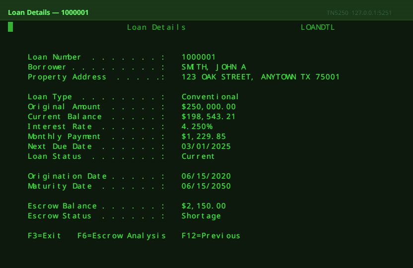
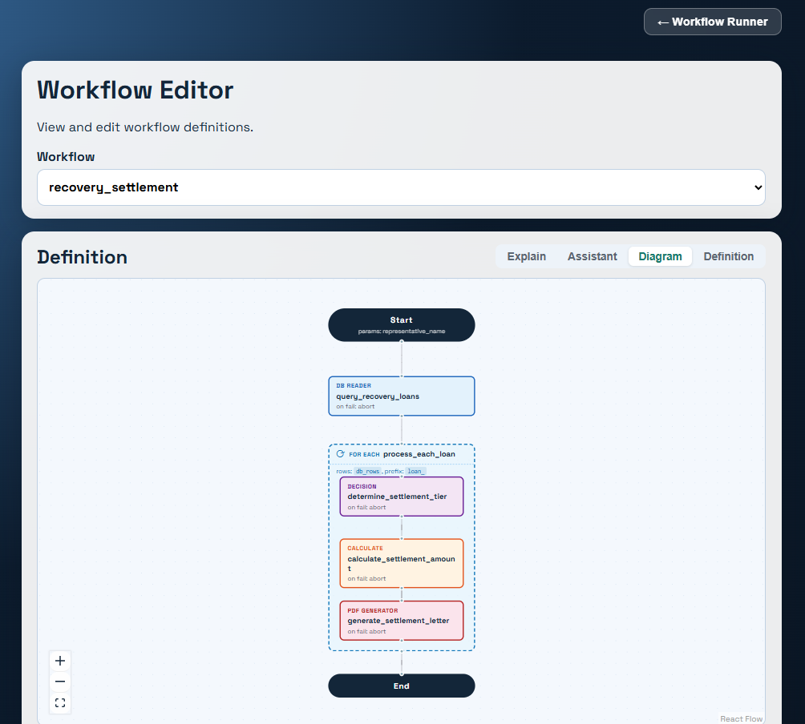

# Hack13 — RPA Engine: Solution Overview

---

## What Is Hack13?

Hack13 is a proof-of-concept **Robotic Process Automation (RPA) engine** built in .NET 8 for the mortgage servicing industry. It automates repetitive, multi-step business workflows — things like logging into a legacy mainframe system, pulling loan data, running calculations, generating documents, and sending emails — without any human involvement once a workflow is triggered.

---

## How It Works (For a Non-Technical Reader)

Think of Hack13 as a **smart assembly line for paperwork**.

You define a workflow as a simple list of steps in a JSON file — "go get this data, run this calculation, make this decision, generate this document, send this email." Each step hands its results to the next step through a shared scratchpad called the **Data Dictionary**.

The engine reads those workflow files, executes each step in order, and handles errors, retries, and branching logic automatically. A web interface lets business users browse workflows, view visual diagrams of how steps connect, and even ask an AI assistant to explain or suggest changes to a workflow — all without writing code.

---

## Configuration: The Heart of the System

**Everything in Hack13 is configuration-driven.** No code changes are needed to modify, add, or remove a workflow. The `configs/` directory contains all the moving parts:

| Location | What It Configures |
|---|---|
| `configs/workflows/*.json` | The ordered list of steps that make up each workflow |
| `configs/components/*.json` | Per-step settings (SQL queries, calculation formulas, email recipients, etc.) |
| `configs/screen-catalog/*.json` | Describes what each mainframe screen looks like and which fields to read |
| `configs/navigation.json` | Rules for how to navigate between mainframe screens |
| `configs/templates/` | HTML templates used to generate PDFs and emails |
| `appsettings.json` | Global API settings: database connection, email transport, AWS credentials, admin security token |
| `.env` | Secrets injected at runtime (AWS keys, admin token) |

A **workflow JSON file** looks like this — a named list of steps, where each step declares what component to run and where its config file lives:

```json
{
  "name": "Escrow Statement Generation",
  "steps": [
    { "component_type": "green_screen_connector", "component_config": "scrape_escrow.json" },
    { "component_type": "calculate",              "component_config": "shortage_calc.json"  },
    { "component_type": "decision",               "component_config": "notice_type.json"    },
    { "component_type": "pdf_generator",          "component_config": "escrow_pdf.json"     },
    { "component_type": "email_sender",           "component_config": "send_notice.json"    }
  ]
}
```

Each component config file holds only what that specific step needs — a SQL query, a formula, a list of decision rules, or an email address. This separation makes workflows easy to read, change, and reuse across different processes.

---

## Current Workflows

| Workflow | Steps | What It Does |
|---|---|---|
| `escrow_statement_generation` | 5 | Scrapes escrow data from mainframe → calculates shortage → decides notice type → generates PDF → emails borrower |
| `escrow-lookup` | 7 | Full AS400 sign-on sequence → navigates to escrow analysis screen → scrapes all loan/escrow fields |
| `recovery_settlement` | 2+ (loops) | Queries DB for recovery loans → for each loan: decides settlement tier, calculates offer, generates letter PDF |
| `db_loan_lookup` | 2 | Simple database-driven loan data retrieval |

---

## Components (The Building Blocks)

Every component implements the same interface: it receives a config file and the shared Data Dictionary, does its work, and writes results back to the dictionary for downstream steps.

---

### `green_screen_connector` — Mainframe Integration
**File:** `src/Hack13.TerminalClient/`

Connects to a TN5250/AS400 "green screen" mainframe over TCP. Given a screen catalog definition, it can **Navigate** to a screen, **Assert** that the expected screen is displayed, and **Scrape** field values into the Data Dictionary. Supports EBCDIC encoding, telnet protocol negotiation, and maintains a full 24×80 character screen buffer. A companion **Mock Server** (`src/Hack13.TerminalServer/`) simulates the AS400 locally for development and testing using the same screen definitions and test loan data.



---

### `calculate` — Arithmetic Engine
**File:** `src/Hack13.Calculator/`

Evaluates arithmetic expressions using values from the Data Dictionary. Expressions like `{{escrow_balance}} * {{shortage_rate}}` are resolved at runtime. Results are written back to the dictionary under a configured output key. Supports all standard math operators and chained calculations.

---

### `decision` — Rules Engine
**File:** `src/Hack13.DecisionEngine/`

Evaluates a set of business rules against Data Dictionary values and sets output variables based on which rules match. Supports `first_match` mode (stops at the first match) and `all_rules` mode (applies every matching rule). Conditions include: `equals`, `not_equals`, `greater_than`, `less_than`, `contains`, `in_range`, and compound `all_of` / `any_of` / `not` logic.

---

### `pdf_generator` — Document Generation
**File:** `src/Hack13.PdfGenerator/`

Renders an HTML template to a PDF file using a headless Chromium browser (PuppeteerSharp). The template is looked up from a registry JSON by name, `{{placeholder}}` tokens are replaced with Data Dictionary values, and the output PDF is saved to the `output/` directory. The PDF path is written back to the dictionary so a downstream email step can attach it.

---

### `email_sender` — Email Delivery
**File:** `src/Hack13.EmailSender/`

Sends emails with optional file attachments (e.g., the generated PDF). Supports three transports configured via `appsettings.json`:
- **`mock`** — logs the email in memory; used in unit tests
- **`smtp`** — sends via a direct SMTP server (e.g., the bundled smtp4dev dev mail catcher)
- **`ses`** — sends via AWS Simple Email Service in production

---

### `database_reader` — Data Query
**File:** `src/Hack13.DatabaseReader/`

Executes a parameterized SQL SELECT query against a configured database. Supports PostgreSQL, SQL Server, MySQL, and SQLite. Single-row results are written as individual keys into the Data Dictionary; multi-row results are written as a JSON array (used with `foreach` iteration in workflows). Connection strings are resolved from the Data Dictionary, so each step can target different databases.

---

### `database_writer` — Data Persistence
**File:** `src/Hack13.DatabaseWriter/`

Executes parameterized SQL INSERT, UPDATE, DELETE, or scalar queries. Writes the rows-affected count or a scalar return value back to the Data Dictionary. Uses the same multi-provider connection abstraction as `database_reader`.

---

### `http_client` — External API Integration
**File:** `src/Hack13.HttpClient/`

Sends HTTP requests (GET, POST, PUT, etc.) to external REST APIs. URL, headers, and body support `{{placeholder}}` token substitution from the Data Dictionary. Response JSON fields are mapped into the Data Dictionary using dot-notation path expressions (e.g., `data.loan.balance → loan_balance`).

---

### `approval_gate` — Human-in-the-Loop Pause
**File:** `src/Hack13.ApprovalGate/`

Pauses workflow execution and polls a REST endpoint on a configurable interval until an approval or rejection response is received, or a wall-clock timeout expires. Enables human review steps inside otherwise automated workflows. Tolerates transient network errors without failing the workflow.

---

## Infrastructure Services (Docker Compose)

| Service | Port | Role |
|---|---|---|
| **postgres** | 5432 | PostgreSQL 16 — loan database with schema and seed data |
| **mock-server** | 5250 | Simulated AS400 mainframe for local development |
| **smtp** | 3000 (UI) / 25 | smtp4dev — catches all outbound emails for developer inspection |
| **db-migrate** | — | One-shot idempotent migration runner at startup |
| **api** | 5000 | The .NET Hack13 API — all REST endpoints + SSE streaming |
| **frontend** | 8080 | React/Vite SPA — the browser-based user interface |

---

## Frontend (Browser UI)

Built with React 18 + Vite, the UI provides three views:

- **Workflow Runner** — Select a workflow, fill in any required starting parameters, hit Run. Watch each step execute in real time via a live-streaming progress feed. Download generated PDFs and see email delivery results on completion.

- **Workflow Catalog** — Browse all available workflows with their name, description, and step count. Expand any workflow to see its full definition as raw JSON.

- **Workflow Editor** — Edit workflow definitions with four tabs:
  - *Diagram* — Interactive visual flowchart of all steps (ReactFlow)
  - *Definition* — Raw JSON editor with format and save buttons
  - *Explain* — One-click AI-generated plain-English description of the workflow (powered by AWS Bedrock / Claude)
  - *Assistant* — Free-text prompt box: ask the AI to suggest specific changes and get back proposed JSON edits



---

## Technology at a Glance

| Concern | Technology |
|---|---|
| Backend runtime | .NET 8 / C# 12, ASP.NET Core Minimal API |
| Mainframe integration | TN5250 protocol (custom client + server), EBCDIC |
| PDF generation | PuppeteerSharp (headless Chromium) |
| AI / workflow assistant | AWS Bedrock — Claude claude-3-5-sonnet-20241022-v2:0 |
| Database | PostgreSQL 16 (primary), SQL Server / MySQL / SQLite (supported) |
| Email | SMTP / AWS SES / smtp4dev mock |
| Frontend | React 18, Vite, ReactFlow |
| Deployment | Docker / Docker Compose (6-service stack) |
| Testing | xUnit — 13 test projects (unit + integration) |
